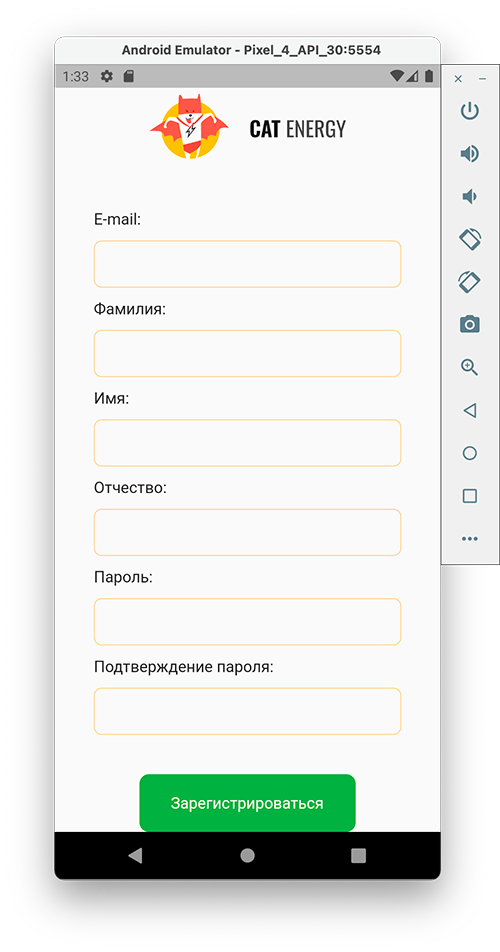
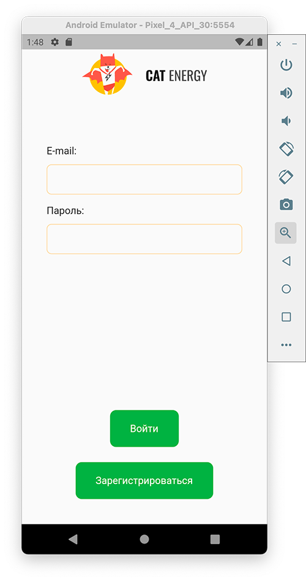
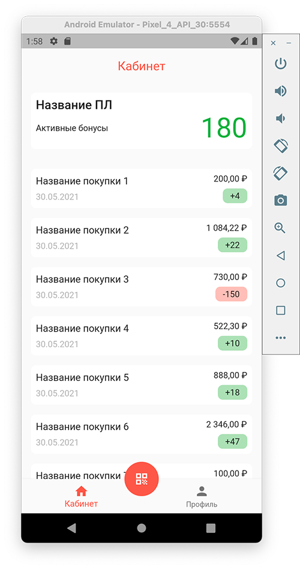
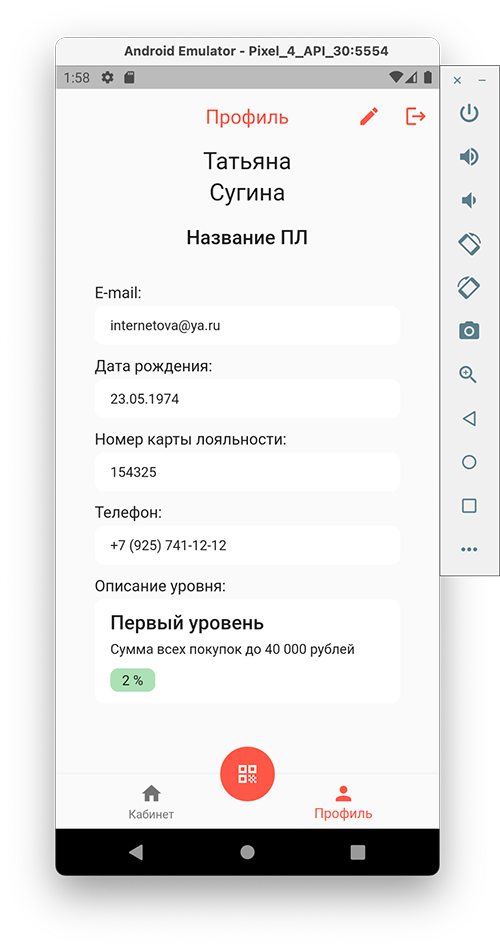
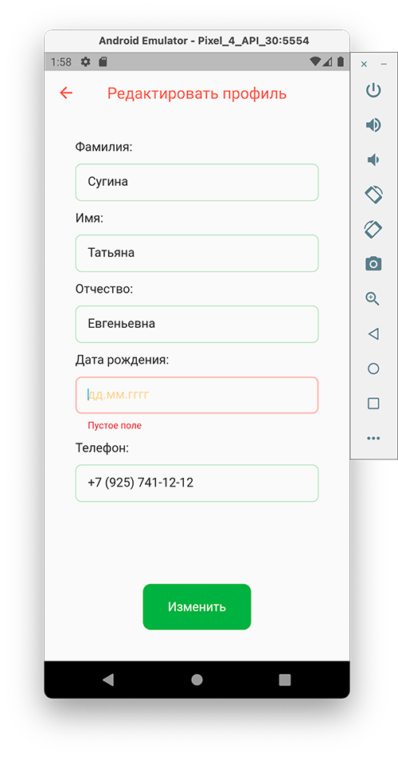
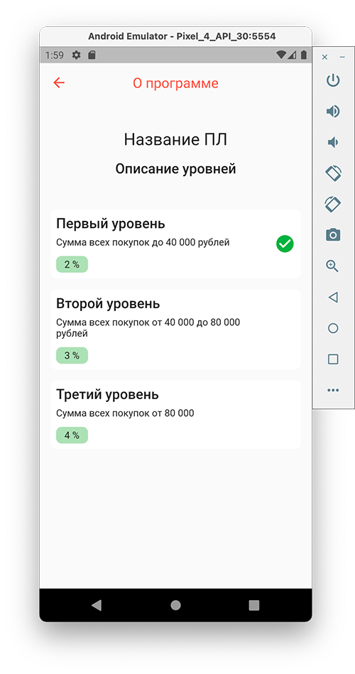
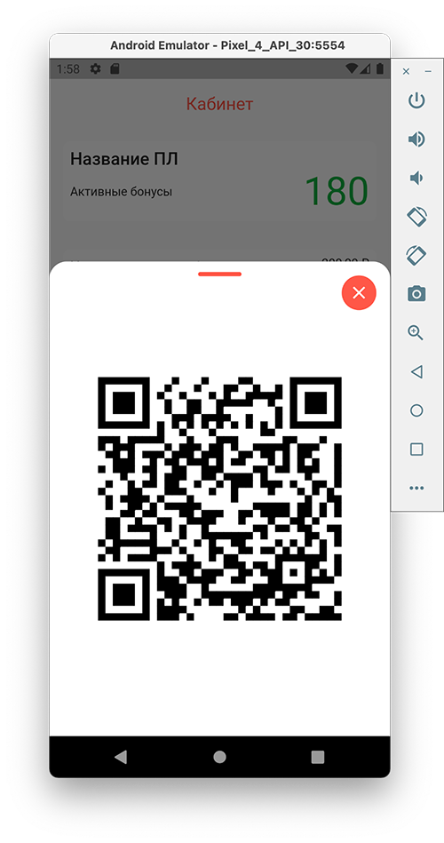

# Программа лояльности

## Тестовое задание

Имитируем мобильное приложение для системы управления лояльностью.
Данные берем из головы:)

- Рега/логин без бэка просто по логопассу (писать во внутреннюю базу)
- Экран кабинета - просто название программы лояльности (ПЛ), баллы, и история покупок инфинит скроллом. 
- Экран с qr - выводит qr картинку попапом
- Экран с деталями по ПЛ выводится при клике на название ПЛ на других экранах
- Экран профиля

-----------
## Что получилось

Буду благодарна за ревью 🤗

### Экран регистрации

### Экран входа

### Экран кабинет

### Экран профиль

### Экран редактировать профиль

### Экран описание программы

### Экран qr код

### Демонстрация работы

----

## Контакты

